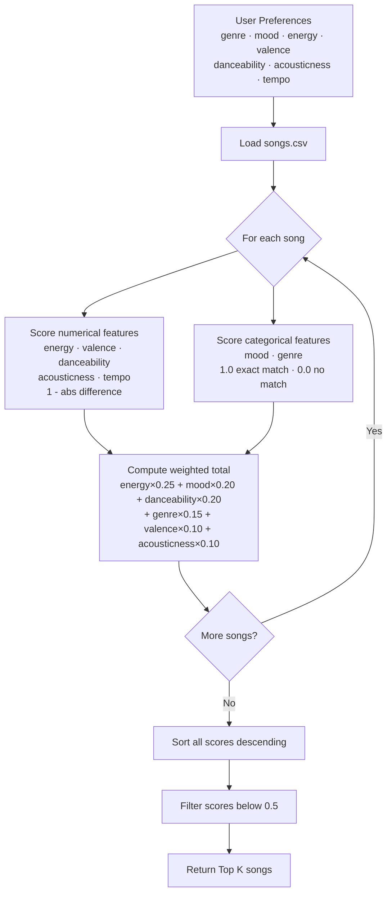

# 🎵 Music Recommender Simulation

## Project Summary

In this project you will build and explain a small music recommender system.

Your goal is to:

- Represent songs and a user "taste profile" as data
- Design a scoring rule that turns that data into recommendations
- Evaluate what your system gets right and wrong
- Reflect on how this mirrors real world AI recommenders

Replace this paragraph with your own summary of what your version does.

---

## How The System Works

Real-world recommenders like Spotify or YouTube predict what you will love next by comparing your listening behavior and taste profile against the features of every song in their catalog. They use two main strategies: collaborative filtering (finding users with similar taste and borrowing their discoveries) and content-based filtering (matching songs by their actual audio qualities — like tempo, mood, or energy). This simulation focuses on content-based filtering, which means it does not need data from other users. Instead, it scores each song by measuring how closely its features match what a single user has said they prefer, then ranks all songs by that score and returns the top matches.

### Song Features

Each `Song` object in the simulation stores the following attributes drawn directly from `data/songs.csv`:

| Feature | Type | What it represents |
|---|---|---|
| `title` | text | Name of the track |
| `artist` | text | Artist name |
| `genre` | categorical | Broad style — e.g. `lofi`, `rock`, `pop`, `ambient` |
| `mood` | categorical | Emotional tone — e.g. `chill`, `intense`, `happy`, `focused` |
| `energy` | numeric (0–1) | How intense or calm the track feels |
| `tempo_bpm` | numeric (60–152) | Beats per minute — speed of the track |
| `valence` | numeric (0–1) | Musical positivity — high = bright/happy, low = dark/melancholic |
| `danceability` | numeric (0–1) | How suitable the track is for dancing |
| `acousticness` | numeric (0–1) | How organic/acoustic vs. produced/electronic the track sounds |

### UserProfile

The `UserProfile` object stores a user's preferred value for each feature above, plus a **weight** for each feature that controls how much it influences the final score. A higher weight means that feature matters more to this user.

```
UserProfile:
  preferred_genre      → e.g. "lofi"
  preferred_mood       → e.g. "chill"
  preferred_energy     → e.g. 0.4
  preferred_tempo_bpm  → e.g. 75
  preferred_valence    → e.g. 0.6
  weights              → { mood: 0.30, energy: 0.25, tempo: 0.20,
                           valence: 0.10, acousticness: 0.10, genre: 0.05 }
```

### How the Recommender Scores Each Song

For every song in the catalog, the `Recommender` computes a **total score between 0 and 1** using a weighted proximity formula:

1. **Numerical features** (energy, tempo, valence, acousticness) use absolute distance — closer to the user's preference scores higher:
   ```
   feature_score = 1 - |user_preference - song_value|
   ```
2. **Categorical features** (genre, mood) are an exact match check:
   ```
   feature_score = 1.0 if match, 0.0 if no match
   ```
3. **Total score** is the weighted average across all features:
   ```
   total_score = (w_mood × mood_score) + (w_energy × energy_score)
               + (w_tempo × tempo_score) + (w_valence × valence_score)
               + (w_acousticness × acousticness_score) + (w_genre × genre_score)
   ```

### How Songs Are Chosen to Recommend

```
Score all songs  →  Sort by total_score descending  →  Return top N results
```

Every song in the catalog gets scored. The ranked list is sorted highest-to-lowest. The top N songs (default: 3) are returned as recommendations. Songs with a total score below a minimum threshold can optionally be excluded, so the system never recommends a poor match just to fill a slot.

---

### Data Flow



---

### Algorithm Recipe

**Step 1 — Score each numerical feature**

```
feature_score = 1 - |user_target - song_value|
```

Applied to the current user profile:

```
energy_score        = 1 - |0.78 - song.energy|
valence_score       = 1 - |0.82 - song.valence|
danceability_score  = 1 - |0.84 - song.danceability|
acousticness_score  = 1 - |0.12 - song.acousticness|
tempo_score         = 1 - |0.54 - song.tempo_normalized|
```

**Step 2 — Score each categorical feature**

```
mood_score  = 1.0  if song.mood  == "confident"  else 0.0
genre_score = 1.0  if song.genre == "dance pop"   else 0.0
```

**Step 3 — Compute weighted total score**

```
total_score = (0.25 × energy_score)
            + (0.20 × mood_score)
            + (0.20 × danceability_score)
            + (0.15 × genre_score)
            + (0.10 × valence_score)
            + (0.10 × acousticness_score)
```

Result is always between 0.0 (no match) and 1.0 (perfect match).

**Step 4 — Rank**

```
sorted_songs = sort all songs by total_score, descending
```

**Step 5 — Return top N**

```
recommendations = sorted_songs[:k]   # default k=5
# optionally filter out songs below total_score < 0.5
```

**Worked example — scoring Espresso (song 18)**

```
mood_score         = 1.0    (confident == confident ✓)
energy_score       = 1 - |0.78 - 0.78| = 1.00
danceability_score = 1 - |0.84 - 0.85| = 0.99
valence_score      = 1 - |0.82 - 0.88| = 0.94
acousticness_score = 1 - |0.12 - 0.12| = 1.00
genre_score        = 0.0    (electropop ≠ dance pop ✗)

total_score = (0.25×1.0) + (0.20×1.0) + (0.20×0.99)
            + (0.15×0.0) + (0.10×0.94) + (0.10×1.0)
            = 0.25 + 0.20 + 0.198 + 0.0 + 0.094 + 0.10
            = 0.842
```

Near-perfect score — only docked because electropop ≠ dance pop, which now carries 0.15 weight (a meaningful but not dominant penalty).

---

### Potential Biases

- **Exact-match cliff for categoricals.** Mood and genre use binary 0/1 scoring. Adjacent categories like `electropop` / `dance pop` or `euphoric` / `confident` score the same as completely unrelated ones. A song that is 90% a match on feeling gets penalized as much as one that is 0%.
- **Sparse genre coverage.** Only 2 of 20 songs are tagged `dance pop`. Giving genre a 0.15 weight means most songs are penalized for not belonging to a niche label, which could unfairly bury otherwise strong matches.
- **Numerical features assume linear taste.** The formula treats all distances as equal — being 0.2 off on energy is penalized identically whether the song is too calm or too intense. Real listeners often have asymmetric preferences (e.g., tolerating slightly low energy but not high).
- **Single user profile.** The weights reflect one user's priorities. A user who cares more about acoustic texture than danceability would get worse results without reconfiguring the weights, so the system is not general-purpose by design.

---

## Getting Started

### Setup

1. Create a virtual environment (optional but recommended):

   ```bash
   python -m venv .venv
   source .venv/bin/activate      # Mac or Linux
   .venv\Scripts\activate         # Windows

2. Install dependencies

```bash
pip install -r requirements.txt
```

3. Run the app:

```bash
python -m src.main
```

### Running Tests

Run the starter tests with:

```bash
pytest
```

You can add more tests in `tests/test_recommender.py`.

---

## Experiments You Tried

All profiles are defined in `src/main.py` and run together with `python src/main.py`. Each block below shows the terminal output and notes what the result reveals about the scoring logic.

---

### Normal Profiles

#### Run 1 — Original: Confident / Dance Pop

The baseline profile modeled after a real playlist (Sabrina Carpenter, Zara Larsson, Don Toliver, Tory Lanez). Energy and danceability carry the most weight. Top result should be "Espresso" or "Can't Tame Her" — songs that are near-perfect numerical matches even though "Espresso" is tagged `electropop`, not `dance pop`.


#### Run 2 — High-Energy Pop

Similar to Run 1 but with the genre locked tighter to `dance pop` and danceability weighted heavily. Songs with high danceability and bright valence should dominate even if their mood label doesn't match.


#### Run 3 — Chill Lofi

Low-energy, high-acousticness profile targeting study or wind-down listening. Energy weight is 0.30 (the highest), so the scorer strongly penalizes anything above ~0.45 energy. Lofi and ambient songs should rank at the top; pop and rock should fall to the bottom.


#### Run 4 — Deep Intense Rock

Near-maximum energy (0.92), dark valence (0.30), fast tempo (~140 BPM). Genre weight is 0.20, the highest of any profile — making this the strictest genre constraint. Only one song in the catalog (`Storm Runner`) is tagged `rock`, so it should score significantly higher than everything else on genre alone.


---

### Adversarial / Edge-Case Profiles

These profiles are designed to expose flaws in the scoring logic, not to model a real listener.

#### Run 5 — Contradicting Mood + Energy (`mood: "sad"`, `energy: 0.90`)

`"sad"` does not appear anywhere in the catalog, so the mood weight (0.20) silently scores 0 for every song. 20% of the score budget is permanently wasted. The top results end up being high-energy tracks — the opposite emotional feel — because numerical energy proximity is the only thing left driving rankings.


#### Run 6 — Phantom Genre + Mood (`genre: "classical"`, `mood: "melancholic"`)

Neither label exists in the catalog. Both categorical weights (0.20 + 0.15 = 35% of budget) are always 0. The scorer falls back entirely on numerical proximity, which means songs are ranked only by how close they are numerically to the target values. The results may look reasonable on paper, but the genre and mood the user asked for are completely ignored.


#### Run 7 — Inflated Weights (sum = 1.80)

All six weights are set to 0.30, making their sum 1.80 instead of 1.00. The scorer never validates or normalizes weights. A song that matches well on all features can score above 1.00 — breaking the `Score: X / 1.00` display contract printed in the terminal output.


#### Run 8 — Out-of-Range Energy (`energy: 1.5`)

Energy is set to 1.5, above the valid 0–1 scale. The proximity formula `1 - abs(1.5 - song_val)` produces a negative value for any song with energy below 0.5. With a 0.40 energy weight, those songs receive a negative score contribution, causing some final scores to go below 0.0. The ranking logic still runs without error, but the results and displayed scores violate the expected 0–1 range.


---

## Limitations and Risks

Summarize some limitations of your recommender.

Examples:

- It only works on a tiny catalog
- It does not understand lyrics or language
- It might over favor one genre or mood

You will go deeper on this in your model card.

---

## Reflection

Read and complete `model_card.md`:

[**Model Card**](model_card.md)

The biggest thing this project made clear is that a recommender does not actually understand music — it just compares numbers. When you tell the system you want "confident dance pop," it does not picture Sabrina Carpenter or a particular vibe. It looks at whatever number was stamped on each song for energy, danceability, and mood, and picks the ones whose numbers are closest to yours. That process works surprisingly well when the catalog is well-matched to the user — Can't Tame Her and Espresso both landed at the top of the High-Energy Pop results for exactly the right reasons. But it falls apart at the edges. The Chill Lofi profile returned an ambient space track (Spacewalk Thoughts) tied for first place above actual lofi songs, not because it sounded like lofi, but because its energy number (0.28) happened to be the closest to the target (0.25). The system had no idea those were different genres of quietness. Similarly, when we ran the Deep Intense Rock profile, Storm Runner was the only rock song in the entire catalog, so it always wins on genre — but slots two through five were filled by high-energy pop and r&b tracks that scored well on numbers alone. The system could not surface a second rock song because none existed.

Comparing the adversarial profiles taught us something more unsettling: the system does not warn you when it is doing something wrong. Setting the mood to "sad" — a label that appears nowhere in the catalog — did not produce an error or a low confidence warning. The scorer just quietly ignored the mood weight and recommended Gym Hero, a high-energy gym anthem, as the top result for someone who asked for sad music. That happens because 30% of the score came from energy proximity (Gym Hero's energy was closest to the target of 0.90), and the 20% mood budget that should have steered things differently was permanently worth zero. The system looked confident — it printed a score of 0.67 out of 1.00 — but the result was completely wrong for what the user wanted. This is how real recommendation systems can develop bias invisibly: not through a single obvious mistake, but through weight distributions and catalog gaps that quietly favor certain users while the output still looks reasonable on the surface.


---

## 7. `model_card_template.md`

Combines reflection and model card framing from the Module 3 guidance. :contentReference[oaicite:2]{index=2}  

```markdown
# 🎧 Model Card - Music Recommender Simulation

## 1. Model Name

Give your recommender a name, for example:

> VibeFinder 1.0

---

## 2. Intended Use

- What is this system trying to do
- Who is it for

Example:

> This model suggests 3 to 5 songs from a small catalog based on a user's preferred genre, mood, and energy level. It is for classroom exploration only, not for real users.

---

## 3. How It Works (Short Explanation)

Describe your scoring logic in plain language.

- What features of each song does it consider
- What information about the user does it use
- How does it turn those into a number

Try to avoid code in this section, treat it like an explanation to a non programmer.

---

## 4. Data

Describe your dataset.

- How many songs are in `data/songs.csv`
- Did you add or remove any songs
- What kinds of genres or moods are represented
- Whose taste does this data mostly reflect

---

## 5. Strengths

Where does your recommender work well

You can think about:
- Situations where the top results "felt right"
- Particular user profiles it served well
- Simplicity or transparency benefits

---

## 6. Limitations and Bias

Where does your recommender struggle

Some prompts:
- Does it ignore some genres or moods
- Does it treat all users as if they have the same taste shape
- Is it biased toward high energy or one genre by default
- How could this be unfair if used in a real product

---

## 7. Evaluation

How did you check your system

Examples:
- You tried multiple user profiles and wrote down whether the results matched your expectations
- You compared your simulation to what a real app like Spotify or YouTube tends to recommend
- You wrote tests for your scoring logic

You do not need a numeric metric, but if you used one, explain what it measures.

---

## 8. Future Work

If you had more time, how would you improve this recommender

Examples:

- Add support for multiple users and "group vibe" recommendations
- Balance diversity of songs instead of always picking the closest match
- Use more features, like tempo ranges or lyric themes

---

## 9. Personal Reflection

A few sentences about what you learned:

- What surprised you about how your system behaved
- How did building this change how you think about real music recommenders
- Where do you think human judgment still matters, even if the model seems "smart"

