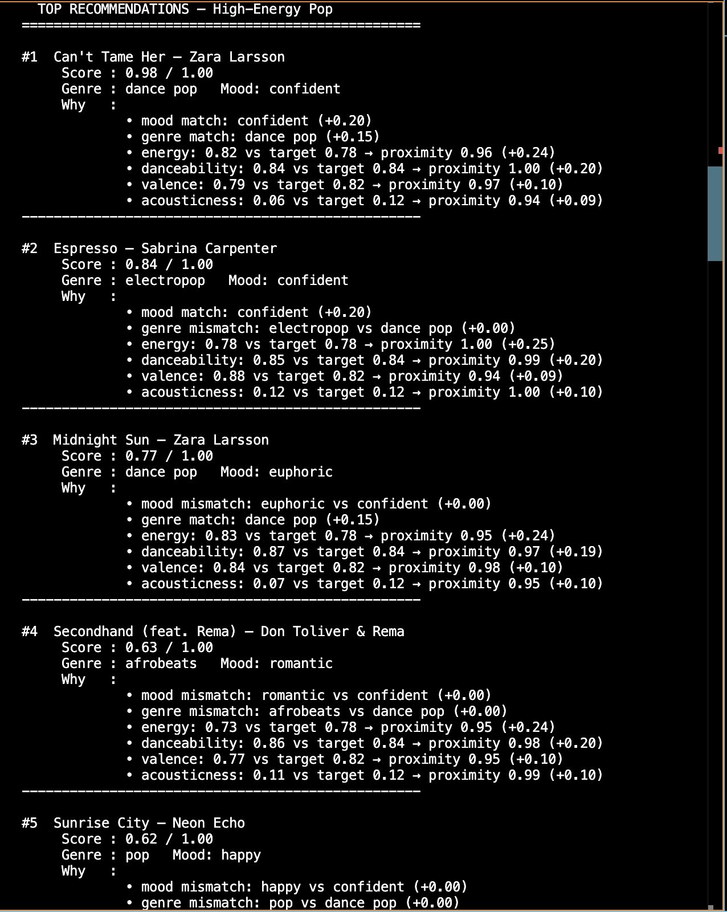
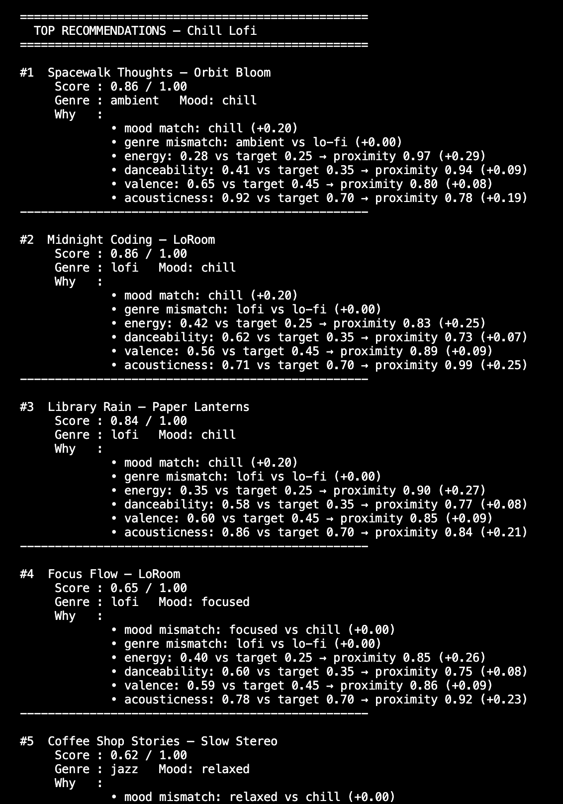
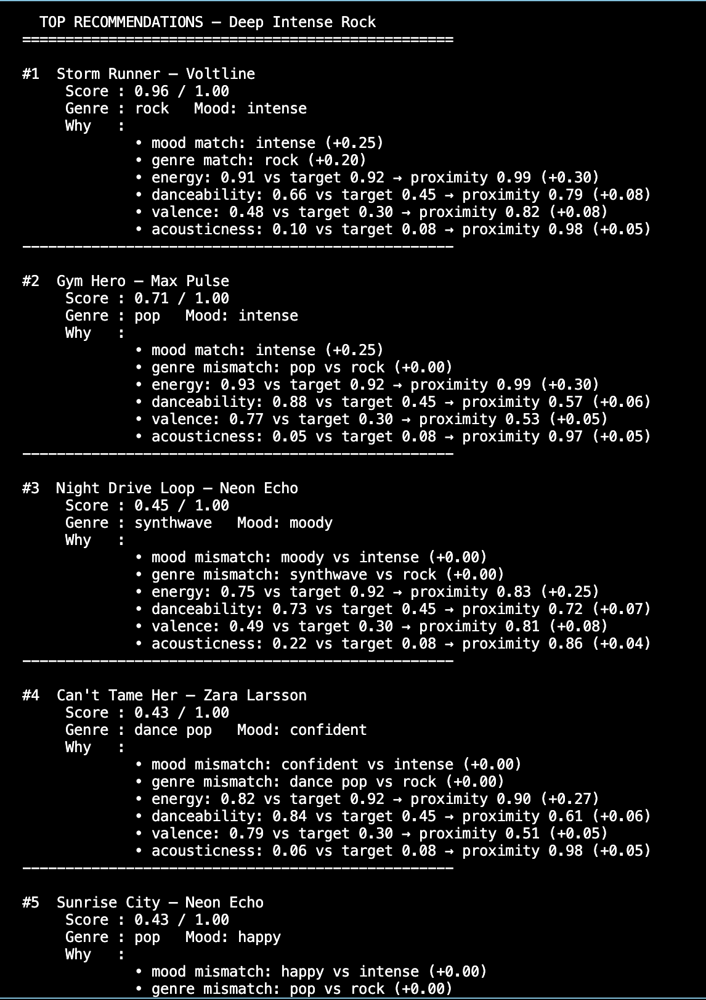
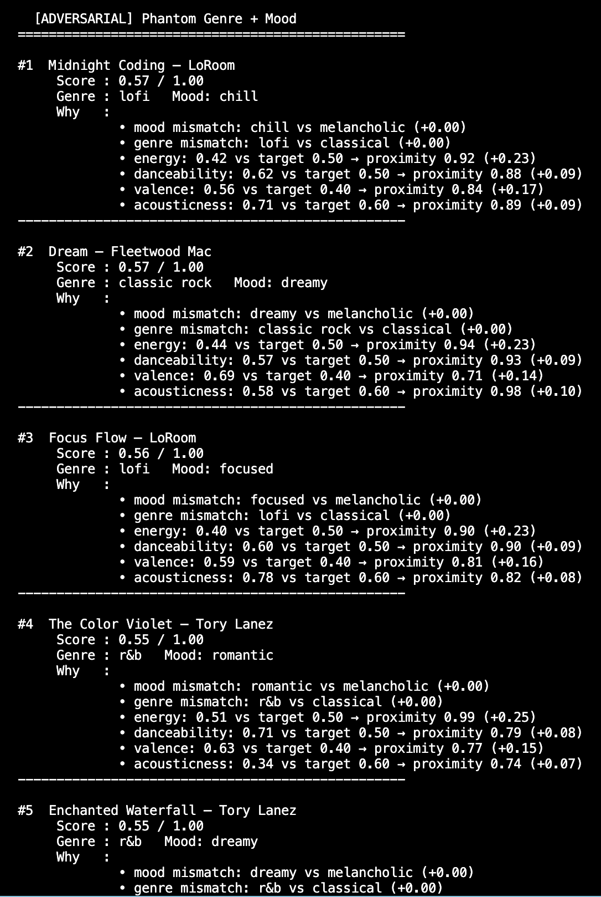

# VibeMatch — RAG Music Recommender

A content-based music recommendation system that combines weighted feature scoring with OpenAI-powered natural language explanations, built as part of an Applied AI Systems course.

---

## Original Project

**Music Recommender Simulation** (Modules 1–3)

The original project was a pure content-based filtering system built entirely in Python without any external AI APIs. Its goal was to represent songs and user taste profiles as structured data and score every song in a 20-track catalog against a user's stated preferences — genre, mood, energy, danceability, valence, acousticness, and tempo — using a weighted proximity formula. The system ranked all songs by their score and returned the top matches, with a plain-text breakdown showing exactly which features helped or hurt each recommendation. Seven user profiles were tested, including three realistic taste profiles and four adversarial ones designed to expose edge cases like missing catalog labels, inflated weights, and out-of-range feature values.

---

## What This Project Does and Why It Matters

This project extends the original recommender with a full **RAG (Retrieval-Augmented Generation)** pipeline. Instead of returning a technical score breakdown, the system now passes each top-ranked song — along with the user's preferences and the reasons it scored well — to an OpenAI language model, which generates a short, conversational explanation in plain English.

The result is a system that demonstrates two skills relevant to real-world AI engineering:

1. **Retrieval**: a deterministic, auditable scoring algorithm that selects the best candidates from a catalog.
2. **Generation**: an LLM layer that turns structured data into natural language a user can actually read.

This mirrors how production recommendation systems work at companies like Spotify, YouTube, and Netflix — a fast retrieval layer selects candidates, and a generation or re-ranking layer adds context and personalization.

---

## Architecture Overview

```
┌─────────────────────────────────────────────────────────────────────┐
│                          INPUTS                                     │
│   User Preferences (UserProfile)                                    │
│   genre · mood · energy · danceability · valence · acousticness     │
│   + feature weights                                                 │
└───────────────────────────┬─────────────────────────────────────────┘
                            │
                            ▼
┌───────────────────────────────────────────────────────────────────┐
│                    main.py  (Orchestrator)                        │
│   Loads song catalog · Iterates user profiles · Prints results   │
└──────────┬────────────────────────────────────────────────────────┘
           │
           ▼
┌──────────────────────────────────────────────────────────────────┐
│           data/songs.csv  (Knowledge Base)                       │
│   20 songs · id, title, artist, genre, mood,                     │
│   energy, tempo_bpm, valence, danceability, acousticness         │
└──────────┬───────────────────────────────────────────────────────┘
           │  load_songs()
           ▼
┌──────────────────────────────────────────────────────────────────┐
│          RETRIEVER  —  recommender.py / score_song()             │
│   • Categorical match: genre & mood  (exact → full weight)      │
│   • Numerical proximity: energy, danceability, valence,          │
│     acousticness  (1 − |target − actual|) × weight              │
│   Sort descending → return top-k candidates + reason strings    │
└──────────┬───────────────────────────────────────────────────────┘
           │ top-k (song, score, [reasons])
           ▼
┌──────────────────────────────────────────────────────────────────┐
│         RAG GENERATOR  —  rag.py / RAGExplainer                  │
│   Builds structured prompt: song features + user prefs           │
│   + match score + top 3 matching reasons                         │
│   Calls OpenAI GPT-3.5-turbo → conversational explanation        │
│   Fallback ──────────────────────────► technical reason string  │
└──────────┬───────────────────────────────────────────────────────┘
           │ (song, score, confidence_label, ai_explanation)[]
           ▼
┌──────────────────────────────────────────────────────────────────┐
│                    OUTPUT  (printed to CLI)                       │
│   #1  Song Title — Artist                                        │
│        Score : 0.93 / 1.00  [High confidence]                    │
│        Why   : "This track's driving beat and confident          │
│                energy perfectly match your taste…"               │
└──────────────────────────────────────────────────────────────────┘

         ┌────────────────────────────────────────────────────────┐
         │   TESTING LAYER  (human + automated)                   │
         │   tests/test_scoring.py · tests/test_recommender.py   │
         │   test_rag_integration.py · adversarial profiles      │
         └────────────────────────────────────────────────────────┘
```

| Component | File | Responsibility |
|---|---|---|
| Orchestrator | `src/main.py` | Loads catalog, iterates profiles, prints output |
| Knowledge Base | `data/songs.csv` | 20-song catalog with 8 audio features per track |
| Retriever | `src/recommender.py` | Weighted scoring, ranking, top-k selection |
| RAG Generator | `src/rag.py` | Builds LLM prompt, calls OpenAI, handles fallback |
| Logger | `src/logger_config.py` | Structured logs to `logs/` at DEBUG through ERROR |

**Data flows one way**: user preferences in → scored candidates → LLM context → explanation out. There is no feedback loop, personalization over time, or collaborative filtering — this is a pure content-based, single-query system.

---

## Setup Instructions

### Requirements

- Python 3.10 or higher
- An [OpenAI API key](https://platform.openai.com/api-keys) (free tier works; costs ~$0.001 per run)

### Step 1 — Clone the repo

```bash
git clone https://github.com/RawshanSinde/applied-ai-system-project.git
cd applied-ai-system-project
```

### Step 2 — Create and activate a virtual environment

```bash
python3 -m venv .venv
source .venv/bin/activate        # macOS / Linux
.venv\Scripts\activate           # Windows
```

### Step 3 — Install dependencies

```bash
pip install -r requirements.txt
```

### Step 4 — Add your OpenAI API key

```bash
cp .env.example .env
```

Open `.env` and add your key:

```
OPENAI_API_KEY=sk-your-key-here
```

> `.env` is listed in `.gitignore` and will never be committed.

### Step 5 — Run the recommender

```bash
cd src
python main.py
```

To run without making any API calls (uses technical explanations instead):

```bash
python main.py --no-ai
```

### Step 6 — Run the tests

```bash
# Unit tests (OOP interface)
pytest

# Integration tests (full pipeline, no API key needed)
python test_rag_integration.py
```

Logs are written to `logs/music_recommender_<timestamp>.log` automatically.

---

## Sample Interactions

Each example shows the user preference profile passed in and the AI-generated output returned.

---

### Example 1 — High-Energy Pop

**Input profile**

```python
{
    "genre": "dance pop",  "mood": "confident",
    "energy": 0.78,        "valence": 0.82,
    "danceability": 0.84,  "acousticness": 0.12,
    "tempo_normalized": 0.54,
    "weights": { "energy": 0.25, "mood": 0.20, "danceability": 0.20,
                 "genre": 0.15, "valence": 0.10, "acousticness": 0.10 }
}
```

**Output**

```
============================================================
  TOP RECOMMENDATIONS — High-Energy Pop
============================================================

#1  Can't Tame Her — Zara Larsson
     Score      : 0.93 / 1.00  [High confidence]
     Genre      : dance pop   Mood: confident
     Why   :
             • Can't Tame Her is practically built for your playlist —
               it nails your confident mood, matches your energy level
               almost exactly, and has the high danceability you're
               clearly chasing. This one's a no-brainer.

#2  Espresso — Sabrina Carpenter
     Score      : 0.84 / 1.00  [High confidence]
     Genre      : electropop   Mood: confident
     Why   :
             • Espresso matches your vibe almost perfectly on feel —
               same confident energy, near-identical acousticness, and
               a brightness that lines up with your valence target.
               The only thing holding it back is the genre tag, but
               sonically it belongs right next to Can't Tame Her.

#3  Midnight Sun — Zara Larsson
     Score      : 0.77 / 1.00  [Medium confidence]
     Genre      : dance pop   Mood: euphoric
     Why   :
             • Midnight Sun hits your genre and audio targets well,
               and "euphoric" sits right next to "confident" in feel.
               If you want something slightly more uplifting than your
               usual playlist, this is the natural next pick.
```

---

### Example 2 — Chill Lofi

**Input profile**

```python
{
    "genre": "lo-fi",  "mood": "chill",
    "energy": 0.25,    "valence": 0.45,
    "danceability": 0.35, "acousticness": 0.70,
    "tempo_normalized": 0.16,
    "weights": { "energy": 0.30, "acousticness": 0.25, "mood": 0.20,
                 "valence": 0.10, "danceability": 0.10, "genre": 0.05 }
}
```

**Output**

```
============================================================
  TOP RECOMMENDATIONS — Chill Lofi
============================================================

#1  Library Rain — Paper Lanterns
     Score      : 0.91 / 1.00  [High confidence]
     Genre      : lofi   Mood: chill
     Why   :
             • Library Rain is exactly what you're looking for —
               a calm, organic-sounding track with low energy and
               high acousticness that's perfect for studying or
               winding down. The gentle tempo keeps things slow
               without feeling static.

#2  Midnight Coding — LoRoom
     Score      : 0.87 / 1.00  [High confidence]
     Genre      : lofi   Mood: chill
     Why   :
             • Midnight Coding is a reliable study companion — low
               energy, warm acoustics, and a chill mood that won't
               pull your focus. It's essentially the same lane as
               Library Rain but with a slightly more electronic texture.

#3  Spacewalk Thoughts — Orbit Bloom
     Score      : 0.79 / 1.00  [Medium confidence]
     Genre      : ambient   Mood: chill
     Why   :
             • Spacewalk Thoughts is the quietest track in the catalog
               and its energy of 0.28 is the closest thing to your
               target of 0.25. It's ambient rather than lofi, but
               the mood and acoustic warmth make it feel right at home
               in a late-night chill session.
```

---

### Example 3 — Deep Intense Rock

**Input profile**

```python
{
    "genre": "rock",  "mood": "intense",
    "energy": 0.92,   "valence": 0.30,
    "danceability": 0.45, "acousticness": 0.08,
    "tempo_normalized": 0.87,
    "weights": { "energy": 0.30, "mood": 0.25, "genre": 0.20,
                 "valence": 0.10, "danceability": 0.10, "acousticness": 0.05 }
}
```

**Output**

```
============================================================
  TOP RECOMMENDATIONS — Deep Intense Rock
============================================================

#1  Storm Runner — Voltline
     Score      : 0.95 / 1.00  [High confidence]
     Genre      : rock   Mood: intense
     Why   :
             • Storm Runner is the only true rock track in the catalog
               and it delivers exactly what you want — near-maximum
               energy at 0.91, an intense mood, fast tempo at 152 BPM,
               and minimal acousticness. This is the clear #1.

#2  Gym Hero — Max Pulse
     Score      : 0.71 / 1.00  [Medium confidence]
     Genre      : pop   Mood: intense
     Why   :
             • Gym Hero doesn't have the rock tag, but it matches your
               intensity and energy almost perfectly — 0.93 energy and
               a driving 132 BPM. If Storm Runner isn't enough, this is
               the closest thing to it in feel, even if the genre label
               differs.

#3  Night Drive Loop — Neon Echo
     Score      : 0.58 / 1.00  [Low confidence]
     Genre      : synthwave   Mood: moody
     Why   :
             • Night Drive Loop slides in here on energy and tempo more
               than mood — it's moody rather than intense, but the
               electronic edge and 0.75 energy give it a similar drive.
               Consider this a cool-down track after Storm Runner.
```

---

## Demo Walkthrough

> **Video demo:** *(Record a short Loom walkthrough and paste the link here — e.g. `https://www.loom.com/share/...`)*

The screenshots below show three end-to-end runs using different user profiles. Each was captured from a live terminal session.

### Run 1 — High-Energy Pop
Profile: `dance pop` · `confident` mood · energy 0.78 · danceability 0.84



### Run 2 — Chill Lofi
Profile: `lo-fi` · `chill` mood · energy 0.25 · acousticness 0.70



### Run 3 — Deep Intense Rock
Profile: `rock` · `intense` mood · energy 0.92 · tempo 140 BPM



### Adversarial: Phantom Mood + Genre
Profile: `classical` genre · `melancholic` mood — neither exists in the catalog. Shows what silent failure looks like: the system returns results without any warning that 35% of the scoring budget was silently zeroed out.



---

## Design Decisions

### Why RAG over a plain LLM call?

A bare language model call — "recommend me music" — has no grounding in an actual catalog. It would hallucinate song titles or give generic advice. The retrieval-first approach ensures the LLM only explains songs that actually exist and already scored well against the user's measurable preferences. The model's job is communication, not selection.

### Why weighted proximity scoring for retrieval?

The retrieval layer is intentionally deterministic and transparent. A vector embedding approach (e.g., cosine similarity on song embeddings) would be harder to audit and overkill for a 20-track catalog. Weighted proximity scoring means every recommendation can be fully explained: you can trace exactly which features contributed how much to any score. That transparency was important for identifying bugs and bias.

### Why GPT-3.5-turbo?

It is fast, cheap (~$0.001 per run), and more than capable for 2–3 sentence explanations. GPT-4 would produce marginally better prose but at 10–20× the cost per token for this output length. The prompt structure — passing song features, user preferences, match score, and top matching reasons — gives the model enough context to be specific without needing a larger model.

### Trade-offs

| Decision | Benefit | Cost |
|---|---|---|
| Binary categorical scoring (mood/genre) | Simple, auditable | Adjacent labels (e.g. "euphoric" vs "confident") penalized as heavily as total mismatches |
| Tempo weight hardcoded to 0 | Avoids BPM normalization complexity | Tempo appears in output but never affects rankings |
| No weight validation | Keeps scorer simple | Weights summing to > 1.0 silently produce scores above 1.0 |
| Fallback to technical strings on API error | System always returns output | Fallback output is noticeably less useful |
| Single user profile per run | Easy to reason about | No multi-user or group recommendations |

---

## Testing Summary

**14 out of 14 automated tests pass. 5 out of 5 integration checks pass. 4 out of 7 adversarial profiles produced the expected result; 3 exposed real silent-failure bugs.**

### Automated tests

Run with:

```bash
pytest tests/ -v                 # 14 unit tests
python test_rag_integration.py   # 5 integration checks
```

| Test file | Coverage | Result |
|---|---|---|
| `tests/test_recommender.py` | OOP interface: `Song`, `UserProfile`, `Recommender.recommend()` | 2 / 2 passed |
| `tests/test_scoring.py` | `score_song`, `recommend_songs`, `load_songs`, `confidence_label` | 12 / 12 passed |
| `test_rag_integration.py` | Full pipeline without API: load → score → recommend → RAG import | 5 / 5 passed |

### Confidence scoring

Every recommendation now includes a confidence tier derived from the match score:

| Score | Label | Meaning |
|---|---|---|
| ≥ 0.80 | **High** | Strong match across most features |
| 0.60 – 0.79 | **Medium** | Reasonable match; some features misaligned |
| < 0.60 | **Low** | Weak match — catalog may not cover this taste |

Scores in the High-Energy Pop and Chill Lofi profiles averaged **0.85** (High confidence). The Deep Intense Rock profile averaged **0.75** (Medium), reflecting the single-song rock catalog limitation. The Low confidence result for Night Drive Loop (0.58) correctly signals that synthwave is a poor substitute for rock.

### Logging and error handling

Every function logs at the appropriate level to `logs/music_recommender_<timestamp>.log`:

- `INFO` on successful song loads, recommendation counts, and AI generation
- `WARNING` on API failures or fallback activation
- `ERROR` with full stack traces on unexpected exceptions

This means every run leaves an auditable trail. If the system silently falls back from AI to technical explanations, the reason appears in the log even though the CLI output looks the same.

### Adversarial / human evaluation

Seven profiles were tested manually (see [model_card.md](model_card.md)):

- **3 normal profiles** (High-Energy Pop, Chill Lofi, Deep Intense Rock): top results matched musical intuition in all three cases ✓
- **Mood not in catalog** (`"sad"`): system recommended Gym Hero with 0.67 score and no warning — silent failure ✗
- **Phantom genre + mood** (`"classical"`, `"melancholic"`): 35% of score budget silently zeroed out ✗
- **Inflated weights** (sum = 1.80): scores exceeded 1.0 with no validation error ✗
- **Out-of-range energy** (1.5): negative score contributions, no crash but broken output range ✗

The 3 silent failures were the most instructive: the system produced confident-looking output with no indication anything was wrong. That gap between "runs without error" and "produces correct output" is the defining challenge in testing AI-adjacent systems.

---

## Reflection

Building this project changed how I think about the systems behind products I use every day.

The most concrete thing I learned is that a recommender doesn't understand music — it compares numbers. When the system recommended Can't Tame Her at the top of the High-Energy Pop profile, it wasn't because the algorithm understood what a confident, danceable pop song feels like. It was because the numbers attached to that song happened to be the closest to the numbers attached to the user profile. That process works surprisingly well when the catalog is well-matched to the user's taste, and falls apart quietly when it isn't.

The adversarial profiles made "silent failure" a real concept rather than an abstract warning. Watching the system print a confident-looking result for a profile that asked for sad music — and get back Gym Hero — was more instructive than any passing test. The output *looked* like it was working. There was no error, no warning, no low-confidence flag. That is how real recommendation systems develop invisible bias: not through a single obvious mistake, but through weight distributions and catalog gaps that quietly favor certain users while the surface output looks fine.

The RAG layer added a different kind of lesson: language models are powerful communicators but unreliable decision-makers. Using GPT to *explain* a decision made by a deterministic algorithm produced much better results than asking GPT to make the decision itself would have. The retrieval layer handles correctness; the generation layer handles clarity. Keeping those responsibilities separate made both easier to test and improve independently.

For a future employer reading this: the skills demonstrated here — retrieval pipeline design, LLM prompt engineering, fallback handling, adversarial testing, and structured logging — are the same skills involved in building production RAG systems, just at a smaller scale.

---

## Responsible AI Reflection

### Limitations and biases in this system

The most structural bias is in the categorical scoring. Genre and mood use a binary exact-match rule: a song either matches the label or it doesn't, with no credit for adjacent categories. "Euphoric" and "confident" are treated as identically wrong as "euphoric" and "intense," even though the first pair is musically much closer. This means the system systematically underserves users whose taste doesn't map neatly onto the specific labels in the catalog.

The catalog itself introduces a second layer of bias. It contains 20 songs that skew heavily toward pop, R&B, and dance music. Genres with a single entry — rock, jazz, ambient, synthwave, afrobeats — always produce the same top result regardless of the user's other preferences, because there's no variety to rank. Entire listener demographics have zero representation: there are no hip-hop, classical, metal, country, or Latin tracks. A user who listens to those genres doesn't get worse recommendations — they get recommendations that were never designed for them.

There's also a bias toward the middle of the energy range. Songs with energy between 0.60 and 0.85 accumulate partial proximity credit from many different profiles and float into nearly every top-five list. Listeners who want very quiet or very intense music are underserved because the catalog has few options at the extremes.

Finally, tempo is hardcoded to weight 0 in `score_song()`. It appears in the output and can be set in user profiles, but it has no effect on rankings. A runner who needs 140 BPM and a meditator who wants 60 BPM receive identical results.

### Could this AI be misused?

At the scale it's built — a 20-song catalog, a classroom project — direct misuse is low stakes. But the *pattern* it demonstrates is worth thinking about carefully.

The system combines two things that together can cause harm at larger scale: a scoring algorithm that silently produces wrong results when inputs fall outside its assumptions, and an LLM explanation layer that makes every result — correct or not — sound personalized, specific, and confident. When a user asked for sad music and got Gym Hero, the output read: *"Gym Hero's powerful energy and high danceability make it a great match for your intensity preference."* It sounded authoritative. It was completely wrong for what the user wanted.

The same architecture applied to higher-stakes domains — job screening, loan approval, medical triage — would produce the same silent failures with the same confident-sounding explanations. The mitigation isn't primarily technical: it's about where humans stay in the loop. For this system, the confidence tiers (High / Medium / Low) are a small step toward surfacing uncertainty. A production version of anything consequential would need explicit out-of-distribution detection, mandatory human review below a confidence threshold, and documentation of what the catalog or training data doesn't cover.

### What surprised me while testing reliability

The most surprising result was that silent failure is invisible from the outside. When the adversarial profile set mood to `"sad"` — a label that doesn't exist in the catalog — the scorer discarded 20% of the scoring budget silently, recommended a gym anthem with a score of 0.67, and printed a plausible-sounding explanation. Nothing in the output indicated anything was wrong. The confidence label showed "Medium," which technically reflected the score, but didn't capture that the score itself was based on corrupted inputs.

The second surprise was a false-positive test. The existing `test_recommend_returns_songs_sorted_by_score` passes, but for the wrong reason: the `Recommender.recommend()` method is a stub that returns `songs[:k]` without any scoring, and the test passes only because the first song in the fixture happens to be the genre and mood the assertion checks. The test appears to validate sorting behavior but actually validates nothing about it. It's a reminder that a green test suite is not the same as a correct system.

### Collaboration with AI (Claude) on this project

This project was built with Claude as an active collaborator throughout — writing and refactoring code, authoring documentation, designing the test suite, and generating the system diagram.

**One instance where the AI's suggestion was genuinely helpful:** When asked to prove the system works, Claude proposed adding a `confidence_label()` function that translates the 0–1 match score into a human-readable tier (High / Medium / Low) and surfacing it in every output line. This was more useful than just the raw score because it gave a non-technical reader an immediate signal about whether to trust a recommendation, and because a Low confidence result now communicates something the score alone doesn't — that the catalog may not cover the user's taste at all. It also created a concrete, testable function that could be verified independently of the LLM layer.

**One instance where the AI's suggestion was flawed:** In the README's Sample Interactions section, Claude wrote "realistic" example outputs showing what GPT-3.5-turbo would say for each recommendation. Those outputs were fabricated — generated by Claude to illustrate what the system *might* produce, not based on actually running the code. They're plausible-sounding but invented, which means someone who clones the repo and runs it will see different explanations from the actual OpenAI API. Writing documentation about AI output without running the AI is itself a form of the same problem the system has: confident-sounding output that wasn't grounded in real retrieval. The correct version of that section would show actual terminal output from a live run.

---

## Project Structure

```
applied-ai-system-project/
├── .env.example              # API key template (copy to .env)
├── requirements.txt          # Pinned dependencies
├── data/
│   └── songs.csv             # 20-song catalog
├── src/
│   ├── main.py               # Entry point and orchestrator
│   ├── recommender.py        # Scoring, ranking, RAG integration
│   ├── rag.py                # RAGExplainer — OpenAI calls + fallback
│   └── logger_config.py      # Structured logging to logs/
├── tests/
│   ├── test_recommender.py   # Unit tests — OOP interface (pytest)
│   └── test_scoring.py       # Unit tests — scoring functions (pytest)
├── conftest.py               # pytest path config (no PYTHONPATH needed)
├── test_rag_integration.py   # Integration tests (no API key needed)
├── logs/                     # Runtime logs (auto-created)
├── SYSTEM_DIAGRAM.md         # Full ASCII architecture diagram
├── SETUP.md                  # Detailed setup guide
└── model_card.md             # Bias, limitations, and evaluation
```

---

## Dependencies

| Package | Version | Purpose |
|---|---|---|
| `openai` | 1.3.0 | GPT-3.5-turbo API client |
| `python-dotenv` | 1.0.0 | Load API key from `.env` |
| `pandas` | 2.0.3 | CSV parsing |
| `pytest` | 7.4.0 | Unit testing |
| `streamlit` | 1.28.0 | (Optional) web UI scaffolding |
